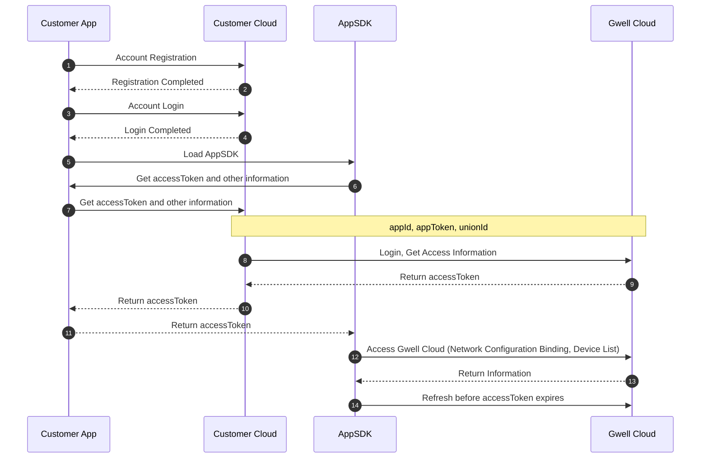

### 1、Preparations
#### Customer has certain App and cloud development capabilities
    Customers need to have the ability to maintain their own App account system, and Gwell Cloud provides a device access capability. The basic functions of the customer App's account management (such as: registration, login) are implemented by the customer themselves

#### Coordinate App configuration information with Gwell development team
Parameter Name | Type | Description
---|---|---
appId | string| Identifies a unique app application, used in subsequent interface calls
appToken | string| app verification token, used in subsequent interface calls
appKey | string| app secret information, generates signature during customer cloud docking


---


### 2、Cloud-to-Cloud Docking Process



---

### 3、API Documentation
● Note: All interface requests must carry signature-related parameters. The signature calculation method is as follows: [Signature Calculation Method](签名计算.en.md)

#### 3.1、Third-party Customer App Account Login
##### 3.1.1. Interface Description
> Customer Cloud requests Gwell Cloud to obtain App user access token.
 
```
Request Address:
post
https://domain/openapi/custCloud/app/user/thirdCustLogin
```

##### 3.1.2. Request Parameters
Parameter          |Type   |Required|Description
------------------|-------|--------|---------------------  
action        |string | Yes |Interface name for the operation, here it is **thirdCustLogin**
appId         |string |Yes  |Assigned by Gwell (request from relevant personnel)
appToken         |string |Yes  |Assigned by Gwell (request from relevant personnel)
uniqueId         |string |Yes  |Terminal unique id, used to distinguish multiple terminals of the same user
unionId         |string |Yes  |Unique id corresponding to the customer App account, it is recommended that the customer cloud pass the unique account id of its own account system
regRegion         |string |Yes  |Country two-letter code (such as: CN), the region where the customer App user is located, used based on GDPR data compliance

**Request Example**
```
curl --location --request POST 'http://localhost:12042/openapi/custCloud/app/user/thirdCustLogin' \
--header 'X-IotVideo-AccessID: 0000175a370efbbe852dc1cd1b0b877e' \
--header 'X-IotVideo-Nonce: 1212' \
--header 'X-IotVideo-Timestamp: 1696757960' \
--header 'X-IotVideo-Signature: e55Cg870djBQZA6ts2s+B1Dlq0g=' \
--header 'Content-Type: application/json' \
--header 'Host: localhost:12042' \
--data-raw '{
    "appId":"0000175a370efbbe852dc1cd1b0b877e",
    "appToken":"a844e8320c75a5c387b78273182513b3fde94911ce9e3478b9d2b041a05a7053",
    "uniqueId":"e27d3172f214497b2bb73ac62be6effb",
    "unionId":"0001",
    "regRegion":"CN"
}'
```

##### 3.1.3. Response Parameters

Parameter          |Type   |Description
------------------|-------|---------------------  
code          |integer|Return error code
msg           |string |Return prompt message
data          |Model |

**data structure**：

Parameter Name       |Type    |Required|Description
---------------------|--------|--------|----
accessToken         |string  | Yes |sdk access token
expireTime         |string  | Yes |token expiration time, unit seconds. The app needs to check if it has expired every time it requests, and if it has expired, it can call the update token interface
accessId         |string  | Yes |Unique user id assigned by Gwell Cloud for the customer account
terminalId         |string  | Yes |Terminal ID
expand         |string  | Yes |Extended information, Json string, after the customer cloud obtains it, it is transmitted to the plug-in through the main App, which is convenient for the plug-in to flexibly expand some businesses without the customer cloud cooperation in the future

**expand structure**：

Parameter Name       |Type    |Required|Description
---------------------|--------|--------|----
area         |string  | Yes |Region assigned to the current user, unknown: unknown region, cn: mainland China, sg: Singapore, de: Germany, us: United States. Returned during registration and login, need to be transmitted back to the cloud in the app public parameters
regRegion    |string  | Yes |User registration region, country two-letter code. Public parameters of the interface are transmitted to Gwell Cloud

##### 3.1.4. Return Result
```
{
    "code": 0,
    "data": {
        "accessToken": "0181E107E47822653B267A000900000064A7A9BF1E9B9CE9EE50512B7C9C455E597E9AFFB155AB04073F80FDA18C6E9A74E1446BCBACA29E3C04FAF0CA15EE52",
        "expireTime": 1699349988,
        "accessId": "-9223371996052586423",
        "terminalId": "-9223371996052586423",
        "expand":"{\"area\":\"cn\",\"regRegion\":\"CN\"}"
    },
    "msg": "ok",
    "requestId": ""
}
```

##### 3.1.5. Error Codes
Error Code |Error Description                          
-----------|---------------------------------
0      |Success                           
10007  |Signature verification failed 
