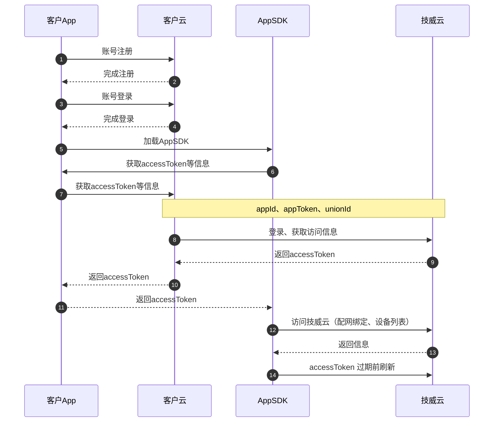

### 1、前期准备
#### 客户拥有一定的App 和云端开发能力
    客户需具备维护自己App账号体系的能力，技威云提供一种设备接入能力。客户App 的账号管理（如：注册、登录）等基础功能，由客户方自己实现

#### 跟技威开发团队对接App配置信息
参数名称 | 类型 | 描述
---|---|---
appId | string| 标识唯一的app应用，后续接口调用时使用
appToken | string| app的验证token，后续接口调用时使用
appKey | string| app密钥信息，客户云云对接时生成签名


---


### 2、云云对接流程



---

### 3、接口文档
● 注：所以接口请求时都需携带签名相关参数，签名计算方式如下：[签名计算方式](签名计算.md)

#### 3.1、第三方客户App账号登录
##### 3.1.1. 接口描述
> 客户云请求技威云，获取App用户访问token。
 
```
请求地址：
post
https://domain/openapi/custCloud/app/user/thirdCustLogin
```

##### 3.1.2. 请求参数
参数          |类型   |必填|描述
--------------|-------|----|---------------------
action        |string | 是 |操作的接口名称，这里为 **thirdCustLogin**
appId         |string |是  |由技威分配（向相关人员索要）
appToken         |string |是  |由技威分配（向相关人员索要）
uniqueId         |string |是  |终端唯一id,用于区分同一个用户的多个终端
unionId         |string |是  |客户App账号对应的唯一id，建议客户云传自己账号体系的唯一账号id
regRegion         |string |是  |国家二字码（如：CN），客户App用户的所在区域，基于GDPR数据合规使用

**请求示例**
```
curl --location --request POST 'http://localhost:12042/openapi/custCloud/app/user/thirdCustLogin' \
--header 'X-IotVideo-AccessID: 0000175a370efbbe852dc1cd1b0b877e' \
--header 'X-IotVideo-Nonce: 1212' \
--header 'X-IotVideo-Timestamp: 1696757960' \
--header 'X-IotVideo-Signature: e55Cg870djBQZA6ts2s+B1Dlq0g=' \
--header 'Content-Type: application/json' \
--header 'Host: localhost:12042' \
--data-raw '{
    "appId":"0000175a370efbbe852dc1cd1b0b877e",
    "appToken":"a844e8320c75a5c387b78273182513b3fde94911ce9e3478b9d2b041a05a7053",
    "uniqueId":"e27d3172f214497b2bb73ac62be6effb",
    "unionId":"0001",
    "regRegion":"CN"
}'
```

##### 3.1.3. 响应参数
参数          |类型   |描述
--------------|-------|---------------------
code          |integer|返回错误码
msg           |string |返回的提示消息
data          |Model |

**data结构**：
参数名       |类型    |必填|描述
-------------|--------|----|----
accessToken         |string  | 是 |sdk 访问token
expireTime         |string  | 是 |token的过期时间，单位秒。app每次请求时需要校验是否过期，如果过期可以调用更新token接口
accessId         |string  | 是 |技威云为客户账号分配的唯一用户id
terminalId         |string  | 是 |终端ID
expand         |string  | 是 |扩展信息，Json字符串，客户云获取后通过主App透传给插件，方便后期无需客户云配合插件可灵活扩展一些业务

**expand结构**：
参数名       |类型    |必填|描述
-------------|--------|----|----
area         |string  | 是 |为当前用户分配的地域，unknown：未知区域，cn：中国大陆，sg：新加坡，de：德国，us：美国。注册登录返回，需app公共参数中透传回云端


##### 3.1.4. 返回结果
```
{
    "code": 0,
    "data": {
        "accessToken": "0181E107E47822653B267A000900000064A7A9BF1E9B9CE9EE50512B7C9C455E597E9AFFB155AB04073F80FDA18C6E9A74E1446BCBACA29E3C04FAF0CA15EE52",
        "expireTime": 1699349988,
        "accessId": "-9223371996052586423",
        "terminalId": "-9223371996052586423",
        "expand":"\{\"area\":\"us\"}"
    },
    "msg": "ok",
    "requestId": ""
}
```

##### 3.1.5. 错误码
错误码 |错误描述                         
-------|---------------------------------
0      |成功                          
10007  |签名校验失败 
