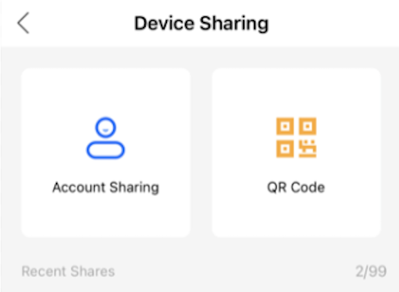
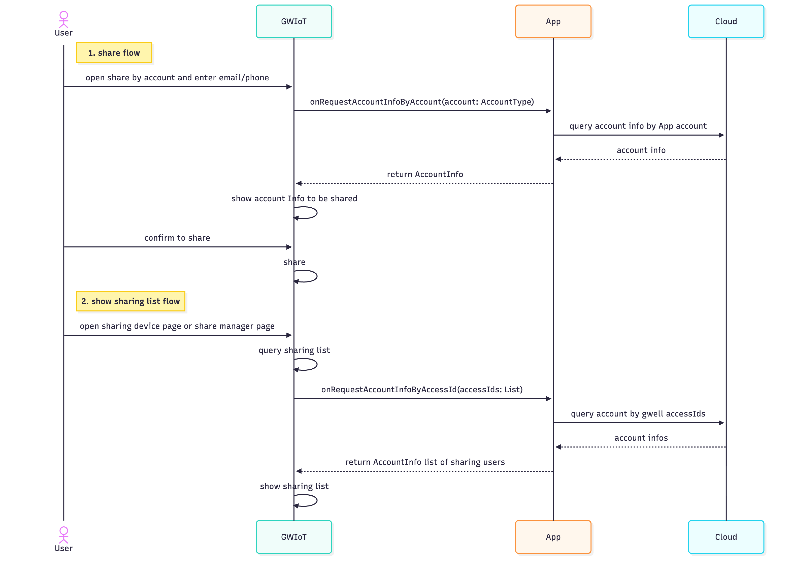

## 开启通过账号分享设备功能

SDK内分享设备用两种方式，通过二维码和通过账号分享设备。但是如果App不使用技威账号服务，初始化时设置了`disableAccountService = true`，则SDK会默认隐藏通过账号分享设备功能。如果需要显示该功能，App需要按照以下步骤实现。

功能预览:



### 实现步骤
#### 初始化时设置分享方式
在设置`disableAccountService = true`后，设置`deviceShareOptions`为需要显示的分享方式。
其中`DeviceShareOption.Account(phone = true)`表示支持账号分享，分享时默认提示用户输入邮箱账号，如果您的App账号支持手机注册，则要将`phone`参数设置为`true`，分享时则会提示用户输入邮箱或者手机号账号。

```kotlin
val opts = InitOptions(AppConfig("appId", "appToken"))
opts.disableAccountService = true 
opts.deviceShareOptions = listOf(DeviceShareOption.QRCode, DeviceShareOption.Account(phone = true)) // 显示二维码分享和账号分享（支持手机号）
GWIoT.initialize(opts)
```

#### 实现并注册接口
SDK需要通过App查询确认并显示被分享用户的账号信息，如昵称、头像，有两个场景需要根据不同的参数进行查询
1. 分享设备流程，通过用户输入的账号查询账号信息
2. 显示设备已分享用户列表，通过技威accessId列表查询账号信息

> 注意，SDK内仅使用昵称、头像在UI上进行展示，不会缓存或者上传到服务器。 App可以对昵称进行脱敏处理再传给SDK，如`test***1`。

详细流程如下：


##### 接口/协议定义
```kotlin

/**
 * App注册账号信息服务组件
 */
interface IHostAccountServiceComponent: IComponent {
    /**
     * 注册账号信息查询服务
     * @param service 实现账号信息查询服务接口的对象
     */
    fun registerHostAccountService(service: IHostAccountService)
}

/**
 *
 * 不使用技威账号服务时，SDK向App查询账号信息的服务接口。
 */
interface IHostAccountService: IComponent {

    /**
     * 通过用户输入的账号(邮箱/手机号)查询App账号信息。
     *
     * 在分享设备，通过账号分享功能处，通过这个接口查询用户进行分享。
     */
    suspend fun onRequestAccountInfoByAccount(account: AccountType): GWResult<HostAccountInfo>

    /**
     * 通过技威账号的accessId查询App账号信息。
     *
     * 在分享设备功能，通过这个接口查询展示分享/被分享用户信息。
     */
    suspend fun onRequestAccountInfoByAccessId(accessIds: List<String>): GWResult<List<HostAccountInfo>>
    
    
}
```
##### 代码示例

- Swift

```swift
/// 注册账号信息服务
GWIoT.registerHostAccountService(HostAccountService())

/// 实现IHostAccountService接口
class HostAccountService: IHostAccountService {
    func onRequestAccountInfoByAccessId(accessIds: [String], completionHandler: @escaping @Sendable (GWResult<NSArray>?, (any Error)?) -> Void) {
        
        /// 根据gwell accessIds从云端查询账号信息
        var mockInfos: [HostAccountInfo] = [
            .init(accessId: "123456", nickName: "test***1", avatarUrl: "https://example.com/example.jpg"),
            .init(accessId: "653421", nickName: "test***2", avatarUrl: "https://example.com/example.jpg"),
        ]
        gwiot_cb(completionHandler, mockInfos as NSArray, nil)
    }


    func onRequestAccountInfoByAccount(account: any AccountType, completionHandler: @escaping @Sendable (GWResult<HostAccountInfo>?, (any Error)?) -> Void) {
        var accountStr: String = ""
        if let account = account as? AccountTypeEmail {
            accountStr = account.email
        }
        
        // 忽略AccountTypeMobile如果账号不支持手机号码
        if let account = account as? AccountTypeMobile {
            accountStr = "\(account.area)-\(account.number)"
        }
        /// 根据账号字符串从云端查询账号信息
        queryAccountInfoByAccount(accountStr) { result in 
            switch result {
            case let .success(json):
                let info = HostAccountInfo(accessId: "gwellAccessId", nickName: "xia****com", avatarUrl: "https://example.com/example.jpg")
                gwiot_cb(completionHandler, info, nil)
            case let .failure(err):
                gwiot_cb(completionHandler, nil, err)
            }
        }
    }
}
```

- kotlin
```kotlin
    // 注册账号信息服务
    GWIoT.registerHostAccountService(object : IHostAccountService {
        override suspend fun onRequestAccountInfoByAccessId(accessIds: List<String>): GWResult<List<HostAccountInfo>> {
            // App需要根据gwell accessIds从云端查询
            val mockInfos = listOf(
                HostAccountInfo(
                    accessId = "123456",
                    nickName = "test***1",
                    avatarUrl = "https://example.com/example.jpg"
                ),
                HostAccountInfo(
                    accessId = "653421",
                    nickName = "test***2",
                    avatarUrl = "https://example.com/example.jpg"
                )
            )
            return GWResult.Success(mockInfos)
        }

        override suspend fun onRequestAccountInfoByAccount(account: AccountType): GWResult<HostAccountInfo> {
            val accountStr = when (account) {
                is AccountType.Email -> account.email
                
                // 忽略AccountType.Mobile如果账号不支持手机号码
                is AccountType.Mobile -> "${account.area}-${account.number}"
            }

            return queryAccountInfoByAccount(accountStr)
        }

        /**
         * 模拟从云端查询账号信息
         */
        private suspend fun queryAccountInfoByAccount(account: String): GWResult<HostAccountInfo> {
            return try {
                // 假设这里是网络请求逻辑
                val info = HostAccountInfo(
                    accessId = "gwellAccessId",
                    nickName = "xia****com",
                    avatarUrl = "https://example.com/example.jpg"
                )
                GWResult.Success(info)
            } catch (err: Exception) {
                GWResult.Failure(err)
            }
        }

    })
```
