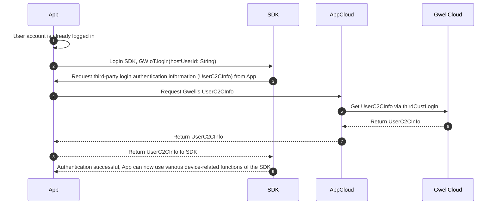

## Third-party Login SDK Documentation

When not using Gwell's account service, the App needs to obtain the information required for SDK login authentication through cloud-to-cloud docking. For details on the cloud interface, please refer to [Cloud-to-Cloud Docking](../cloud/客户云云对接.en.md).

The overall process is as follows:



### 1. App determines account is logged in

Whether the user logs in again or the App reads cached login information during cold start, both are considered account login.

### 2. Login SDK

After the App user logs in, call the SDK's `login(hostUserId: String)` method to log in. `hostUserId` is the unique identifier of the currently logged-in user in the App. The SDK only uses it to determine whether it has cached the login information for this user and will not upload it to Gwell Cloud. The App can encrypt it before passing it to the SDK.

### 3. SDK requests login authentication information from App

If the SDK does not have cached login information for the specified user, it will request login authentication information from the App.

**The App needs to implement the relevant interface methods of the SDK to return login authentication information.**

#### Interface Definition

```kotlin
/**
 * App registers account information service component
 */
interface IHostAccountServiceComponent: IComponent {
    /**
     * Register account information query service
     * @param service Object implementing the account information query service interface
     */
    fun registerHostAccountService(service: IHostAccountService)
}

/**
 *
 * When not using Gwell account service, this is the service interface for SDK to query account information from App.
 */
interface IHostAccountService: IComponent {
    /**
     * Request to get account authentication information for App cloud and Gwell cloud docking
     *
     * If the App login interface already includes the account information acquisition for cloud-to-cloud docking, 
     * it can cache it in memory and return directly to avoid repeated requests
     */
    suspend fun onRequestUserC2CInfo(): GWResult<UserC2CInfo>
}
```

#### App Code Examples

- Swift

```swift
/// Register account information service
GWIoT.registerHostAccountService(HostAccountService())

/// Implement IHostAccountService interface
class HostAccountService: IHostAccountService {
    func onRequestUserC2CInfo(completionHandler: @escaping (GWResult<UserC2CInfo>?, (any Error)?) -> Void) {
        requestGwellC2CInfo { info, error in
            gwiot_cb(completionHandler, info, error)
        }
    }
    
    private func requestGwellC2CInfo(_ finish:(UserC2CInfo?, Error?) -> Void ) {
        // request Gwell C2CInfo from your cloud
    }
}
```

- Kotlin
```kotlin
    // Register account information service
    GWIoT.registerHostAccountService(object : IHostAccountService {
        override suspend fun onRequestUserC2CInfo(): GWResult<UserC2CInfo> {
            // request Gwell C2CInfo from your cloud, then return
            return GWResult.success(UserC2CInfo("accessId", "accessToken", "expireTime", "terminalId", "expend"))
        }
    })
```


The `UserC2CInfo` class defined in the SDK is consistent with the fields returned by Gwell Cloud. Pass it directly to the SDK without any modifications.

```kotlin
/**
 * Account authentication information for cloud-to-cloud docking
 *
 * @param accessId Unique user id assigned by Gwell Cloud for the customer account
 * @param accessToken Interface access token
 * @param expireTime Token expiration time, in seconds
 * @param terminalId Terminal ID
 * @param expend Extended information, please directly pass through the expend string returned by Gwell Cloud
 *
 */
data class UserC2CInfo(
    val accessId: String,
    val accessToken: String,
    val expireTime: String,
    val terminalId: String,
    val expend: String
)

```