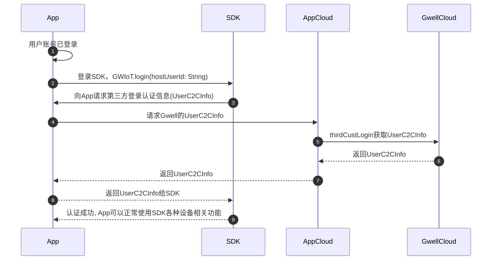

# 第三方登录SDK说明

## 登录流程
当不使用技威的账号服务时，App需要通过云云对接方式获取SDK登录认证所需的信息，云端接口说明详见[云云对接](../cloud/客户云云对接.md)。

总体流程如下：


### 1. App判断账号已登录

无论是用户重新登录或者App冷启动读取缓存登录信息，都属于账号登录。

### 2. 登录SDK

App用户登录后调SDK的`login(hostUserId: String)`方法进行登录。`hostUserId`是App当前登录的用户唯一标识符，SDK仅用于判断是否缓存了这个用户的登录信息，不会上传到技威云。App可以加密后再传给SDK。

### 3. SDK向App请求登录认证信息
如果SDK没有缓存指定用户的登录信息，则会向App请求登录认证信息。

**App需要实现SDK的相关接口方法，用于返回登录认证信息。**

#### 接口定义
```kotlin
/**
 * App注册账号信息服务组件
 */
interface IHostAccountServiceComponent: IComponent {
    /**
     * 注册账号信息查询服务
     * @param service 实现账号信息查询服务接口的对象
     */
    fun registerHostAccountService(service: IHostAccountService)
}

/**
 *
 * 不使用技威账号服务时，SDK向App查询账号信息的服务接口。
 */
interface IHostAccountService: IComponent {
    /**
     * 请求获取App云和技威云对接的账号认证信息
     *
     * 如果App登录接口已经包含了云云对接的账号信息获取，可以内存缓存下来直接返回，避免重复请求
     */
    suspend fun onRequestUserC2CInfo(): GWResult<UserC2CInfo>
}
```

#### App代码示例

- Swift

```swift
/// 注册账号信息服务
GWIoT.registerHostAccountService(HostAccountService())

/// 实现IHostAccountService接口
class HostAccountService: IHostAccountService {
    func onRequestUserC2CInfo(completionHandler: @escaping (GWResult<UserC2CInfo>?, (any Error)?) -> Void) {
        requestGwellC2CInfo { info, error in
            gwiot_cb(completionHandler, info, error)
        }
    }
    
    private func requestGwellC2CInfo(_ finish:(UserC2CInfo?, Error?) -> Void ) {
        // request Gwell C2CInfo from your cloud
    }
}
```

- kotlin
```kotlin
    // 注册账号信息服务
    GWIoT.registerHostAccountService(object : IHostAccountService {
        override suspend fun onRequestUserC2CInfo(): GWResult<UserC2CInfo> {
            // request Gwell C2CInfo from your cloud, then return
            return GWResult.success(UserC2CInfo("accessId", "accessToken", "expireTime", "terminalId", "expend"))
        }
    })
```


SDK内定义的`UserC2CInfo`类和Gwell Cloud返回的字段是一致的，直接透传返回给SDK即可，不要进行任何修改。
```kotlin
/**
 * 云云对接的账号认证信息
 *
 * @param accessId 技威云为客户账号分配的唯一用户id
 * @param accessToken 接口访问token
 * @param expireTime token的过期时间，单位秒
 * @param terminalId 终端ID
 * @param expend 扩展信息，请直接透传技威云返回的expend字符串
 *
 */
data class UserC2CInfo(
    val accessId: String,
    val accessToken: String,
    val expireTime: String,
    val terminalId: String,
    val expend: String
)

```


## 账号多端/单端登录说明

SDK的登录终端通过[云云对接](../cloud/客户云云对接.md)中的`thirdCustLogin`接口的`uniqueId`字段进行区分。
- 如果要实现多端登录，这个字段应该通过App获取手机设备的唯一ID，尽量保证唯一即可，建议生成后缓存下来，避免每次启动App都重新生成。也可以使用SDK的`GWIoT.phoneUniqueId()`方法进行获取。
- 如果要实现单端登录，这个字段可以固定为一个值，建议传unionId一样的值。

### 账号事件处理

SDK会通过`accountEvent`LiveData通知App账号事件，App需要监听这个事件，根据事件类型进行处理，特别是限制单端登录时。
```swift
        GWIoT.shared.accountEvent.observe(weakRef: self) { event in
            switch onEnum(of: event) {

            case .kickedOut:
                // 处理账号被踢出事件，单端登录时账号在其他终端登录，则会触发
                break
                
            case .accessTokenExpired:
                // 处理token过期事件, App如果没调SDK退出登录，SDK内会自动刷新token，暂时可以忽略
                break

            case .accountUnregistered:
                // 处理账号注销事件，目前云端接口不支持账号注销，暂时忽略
                break

            default: break
            }
        }
```

kotlin
```kotlin
        GWIoT.accountEvent.observeForever(object : Observer<AccountEvent> {
            override fun onChanged(value: AccountEvent) {
                when (value) {
                    is AccountEvent.KickedOut -> {
                        // 处理账号被踢出事件，单端登录时账号在其他终端登录，则会触发
                    }
                    is AccountEvent.AccessTokenExpired -> {
                        // 处理token过期事件, App如果没调SDK退出登录，SDK内会自动刷新token，暂时可以忽略
                    }
                    is AccountEvent.AccountUnregistered -> {
                        // 处理账号注销事件，目前云端接口不支持账号注销，暂时忽略
                    }
                }
                
            }
        })
```


