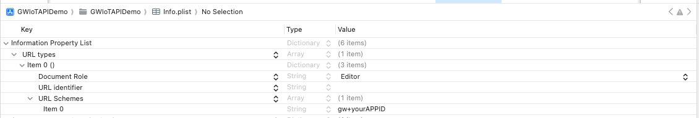

[API Referfence](https://reoqoo.github.io/gwiotapi/api/-g-w-io-t-api/com.gw.gwiotapi/-g-w-io-t/index.html)

## Introduction
This is a demo of the `GWIoTKit` usage.  
`GWIoTKit` is combined from lots of frameworks, our original intention was just let users focus on the `GWIoTApi` Framework, but it is obvious that this expectation has not been achieved yet. We will continue to update in the future.

## Installation
#### CocoaPods
```ruby
source 'https://github.com/CocoaPods/Specs.git'
platform :ios, '15.0'
use_frameworks!

target 'MyApp' do
  # pod 'GWIoTKit', :subspecs => ['Core', 'RQIAPKit'] # with In App Purchase function
  # pod 'GWIoTKit' # without In App Purchase function
end
```

## Launch the demo
1. After registered from our dev webside, you would get the `AppID` `AppToken` `AppName`.
2. Edit the `AppInfo.swift` file in `GWIoTAPIDemo`, replace `AppID` `AppToken` `AppName`.
3. For the `In App Purchase` function, you need to add a record with `URLTypes` in your App `Info.plist`, like below:

syntax: `gw` + `your appID`  
example: `gw1234567890` 
4. For discovering cams in the LAN when adding them.  
- Add `NSBonjourServices` key into your App's Info.plist, like below:
```xml
	<key>NSBonjourServices</key>
	<array>
		<string>_leboremote._tcp</string>
		<string>_adhp._tcp</string>
		<string>_me-transferdata._tcp</string>
		<string>_bonjour._tcp</string>
		<string>_lnp._tcp</string>
	</array>
```  
- Add `Access Wi-Fi Information`, `Hotspot` to you App's `Signing & Capabilities`.  

5. Add `Background Modes`, `Push Notifications` to you App's `Signing & Capabilities`, and checkout the `Remote notification` if you need the remote notification function.  

## Compatibility
#### It should be noted that the sdk requires a specific version of xcode to be compiled normally. The following is the compatibility table

| SDK Version | Xcode Version |
| --- | --- |
| 1.0.1 | 16.2 |
| 1.0.2 | 16.4 |
| 1.0.3 | 16.4 |
| 1.0.4 | 16.4 |
| 1.1.5.0 | unrestricted |
| 1.1.6.0 | unrestricted |
